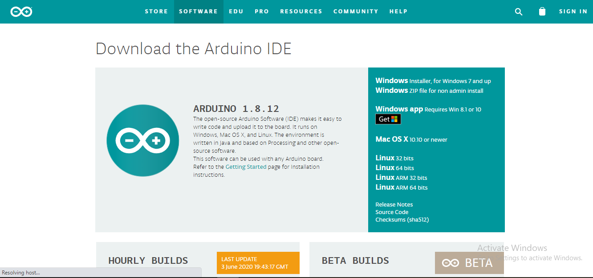
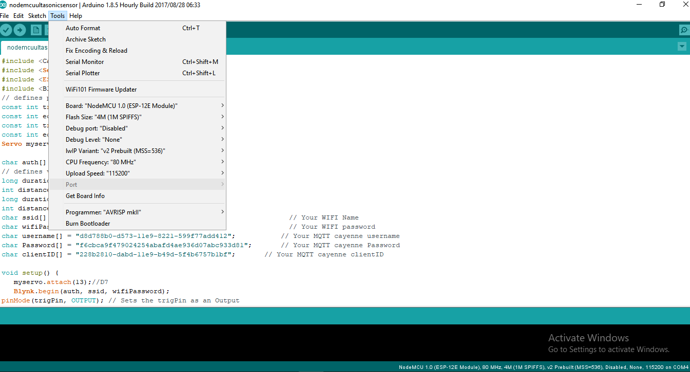
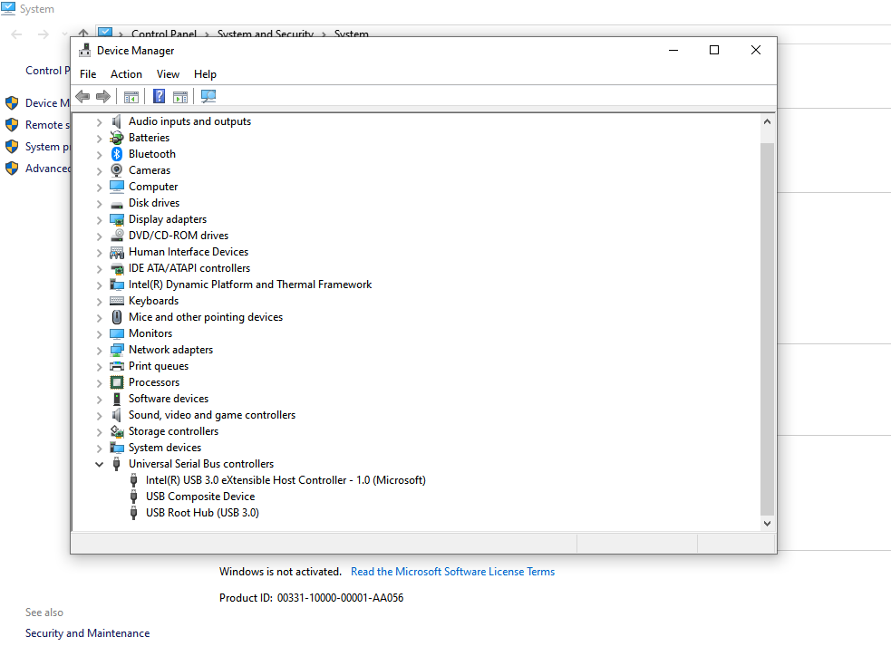
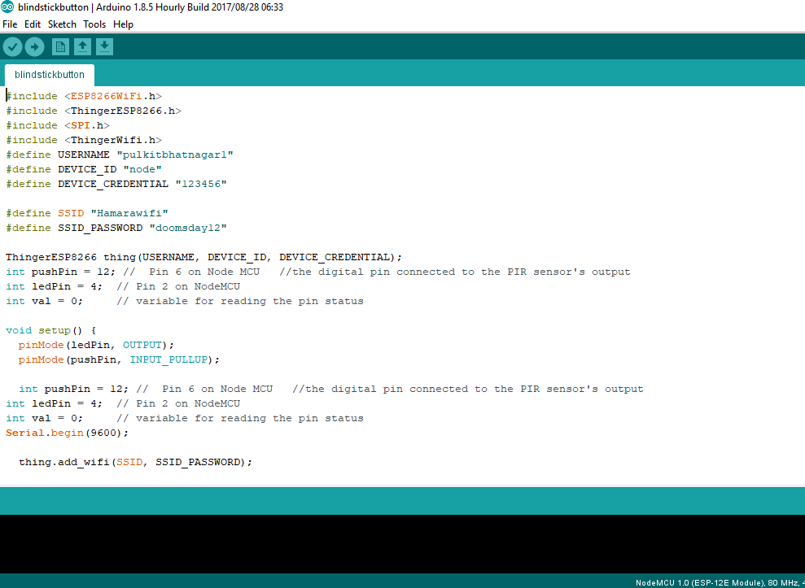
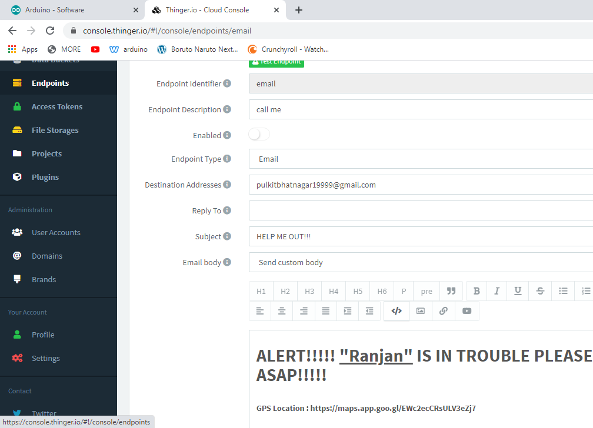
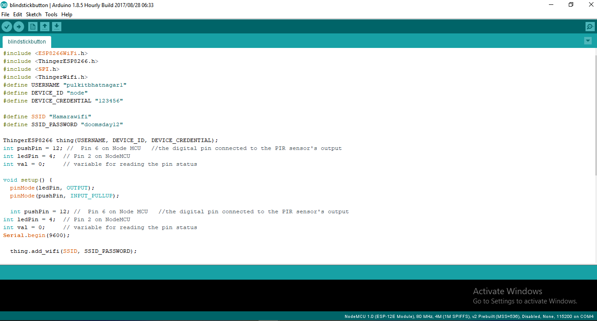
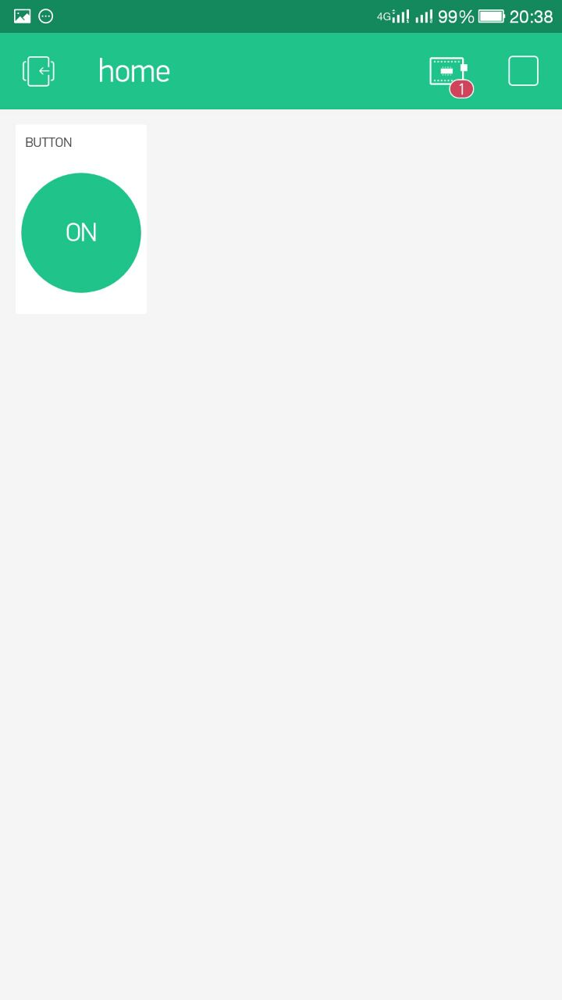
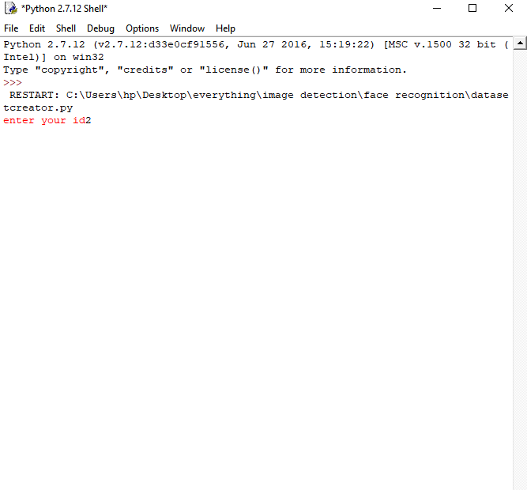
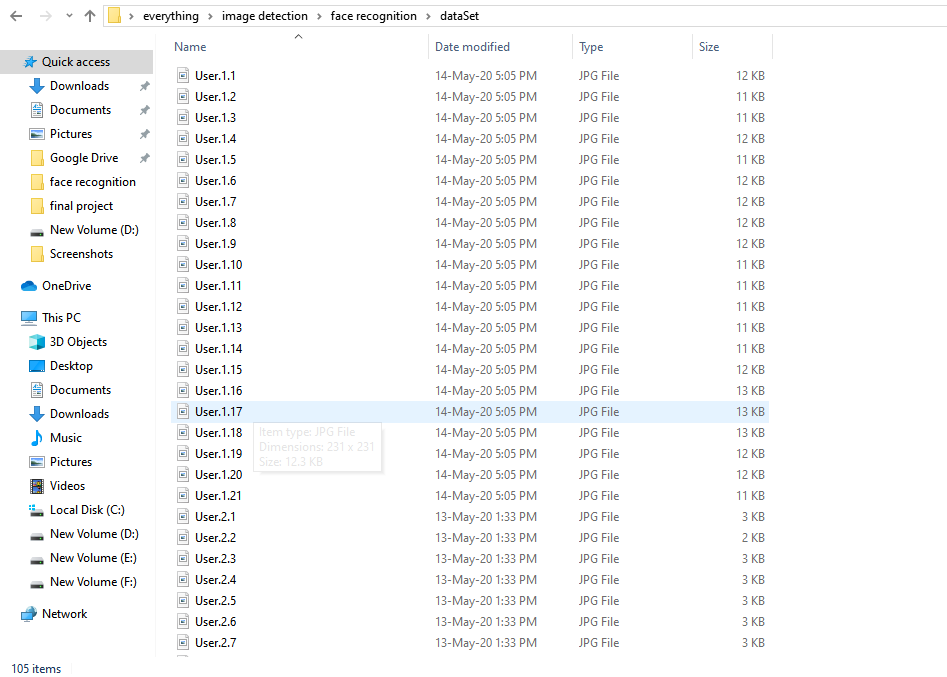
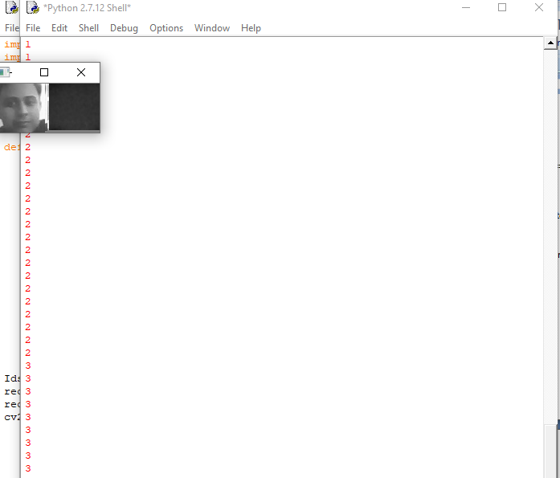

# SmartBlindStick - R33

Requirements
====================================
Modern Operating System:

Operating systems: - Windows® 10, macOS*, and Linux*

Linux: -   RHEL 6/7, 64-bit (almost all libraries also work in Ubuntu) x86 64-bit CPU (Intel / AMD architecture)

RAM:-           4 GB RAM

Disk space: - 2 to 3 GB

Processors:-   Intel® Core™ i5 processor 4300M at 2.60 GHz or 2.59 GHz (1 socket, 2 cores, 2 threads per core), 8 GB of DRAMIntel® Xeon® processor E5-2698 v3 at 2.30 GHz (2 sockets, 16 cores each, 1 thread per core), 64 GB of DRAMIntel® Xeon Phi™ processor 7210 at 1.30 GHz (1 socket, 64 cores, 4 threads per core), 32 GB of DRAM, 16 GB of MCDRAM (flat mode enabled)

WARNING
=====================================
->Make sure the the arduino is disconnected to the power source before connections sensors

->Arduino can handle upto 12V of power supply 

->Arduion is not water resistant neither are the sensors

->Arduino only handles dc power supply.

STEPS TO SETUP ARDUINO IDLE
============================

Step1:- Go to the arduino software site or copy the link on your web browser https://www.arduino.cc/en/main/software

Step2:- Clink on the software tab on the top and then to the downloads.

Step3:- Click on the download IdLe under downloads by selecting the right configurations  of your system you are working on.

Step4:- Connect your arduino with the system

Step5:- Open the idle then go to "Tools->Port"

 
Step6:- If the port is available then select and we are ready to go

Step7:- If port is not available the go the "This PC->right click->properties->device manager->universal serial bus controller" there select the port available.

 
Step8:- Once all the above steps are done write the code and upload it in the harware.

RUNNING FIRST PROGRAM (SMART STICK FOR BLIND)
=============================================

Step1:-Copy paste the program from the documents and import the respective library.

Step2:-Make the connections according to the pin mention in the program.

Step3:-Connect the Arduino with the system

Step4:-Select the port  and upload the code

 
RUNNING SECOND PROGRAM (Emergency button for SMART Stick)
=========================================================
Step1:-Copy paste the program from the documents and import the respective library.

Step2:-Make the connections according to the pin mention in the program.

Step3:-Open Thinger.io platform and login with your credentials  ,Once done then create an endpoint as email by typing email address and the message.

 
Step4:-Register the device as nodemcu under the device section and we will get the username and password in order to connect the device to the application.

Step5:-Copy and paste the username and password given by thinger.io in place of the username and password in the program

Step6:-Upload the program to the hardware and it will take few seconds to connect. 

Step7:-Once connected by oressing the button we will send the message.
 

RUNNING THIRD PROGRAM (Appliances Access through Voice Commad)
==============================================================

Step1:-Copy paste the program from the documents and import the respective library.
Code for Appliances Access through Voice Command

/*************************************************************

  Download latest Blynk library here:
    https://github.com/blynkkk/blynk-library/releases/latest

  Blynk is a platform with iOS and Android apps to control
  Arduino, Raspberry Pi and the likes over the Internet.
  You can easily build graphic interfaces for all your
  projects by simply dragging and dropping widgets.

    Downloads, docs, tutorials: http://www.blynk.cc
    Sketch generator:           http://examples.blynk.cc
    Blynk community:            http://community.blynk.cc
    Follow us:                  http://www.fb.com/blynkapp
                                http://twitter.com/blynk_app

  Blynk library is licensed under MIT license
  This example code is in public domain.
 *************************************************************
  This example runs directly on ESP8266 chip.

  Note: This requires ESP8266 support package:
    https://github.com/esp8266/Arduino

  Please be sure to select the right ESP8266 module
  in the Tools -> Board menu!

  Change WiFi ssid, pass, and Blynk auth token to run :)
  Feel free to apply it to any other example. It's simple!
 *************************************************************/

Step2:-Make the connections according to the pin mention in the program.

Step3:-Download the blynk app in the mobile and create a project by choosing two button and assigning a digital pin to them. Once done we will get an email from blynk with the credentials.

Step4:-Open the ifttt platform and login with your facebook account

Step5:-Click on the applets and create a new by selecting “if this then that” phrase from the list. 

Step6:-Click on the” this” of the phrase and a pop up will be open ,there  select google assistant and add a phrase like is “turn on the light” to connect  with the device.

Step7:-Click on the” that” of the phrase and a pop up will be open ,there provide button no mention in the blynk  app and the credentials from the email.

Step8:-Once down upload the program and it will take few seconds to connect.

Step9:-Now when u will say the phrase in your mobile the respective action will be performed. 

 

STEPS TO SETUP IMAGE PROCESSING
================================

Step1:- Go to the ANACONDA site or copy the link on your webbrowser "https://www.anaconda.com/".

Step2:- Click on the product tab on the top and then to the "individual edition".

Step3:- Click on the download  under downloads by selecting the right configurations  of your system you are working on.

Step4:- Open the anaconda and then launch the spyder

Step5:- Open the anaconda command prompt and type "pip install library" related to the program.

Step5:- Write the program and then click on the run, it will ask for the file name and location.

Step6:- The program will execute

RUNNING FOURTH PROGRAM (DATASET CREATION)
===================================================================
Step1:-Copy the respective code to the spyder shell and run the program 

Step2:-Once the program is run it will ask for the location ad the filename.

Step3:-After compilation it will ask for the “id”  which is any integer no and then it will take 20 images of you and save to the exact location where the file has been saved.

 
Step4:-The whole process will take few seconds and will terminate automatically.

RUNNING FIFTH PROGRAM (TRAINER)
===================================================================
Step1:-Copy the respective code to the spyder shell and run the program 

Step2:-Once the program is run it will ask for the location and the filename, save to the same location where above part is saved.

Step3:-After execution the program will use LBPHF algorithm to train the model on the dataset which is made by capturing the image.

Step4:-The whole process will take few seconds and will terminate automatically.

RUNNING SIXTH PROGRAM (PREDICTION)
===================================================================
Step1:-Copy the respective code to the spyder shell and run the program 

Step2:-Once the program is run it will ask for the location and the filename, save to the same location where above part is saved.

Step3:-After execution the program will open the system camera  and will try to compare the image with image in the dataset, if found then the name will be displayed on the screen otherwise  “unknown” will be displayed.

Step4:-The whole process will take few seconds and will terminate automatically.

